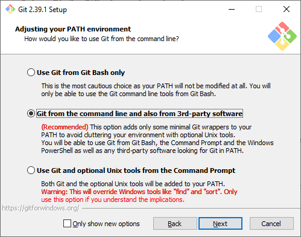
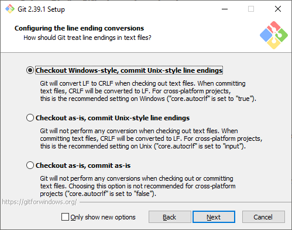
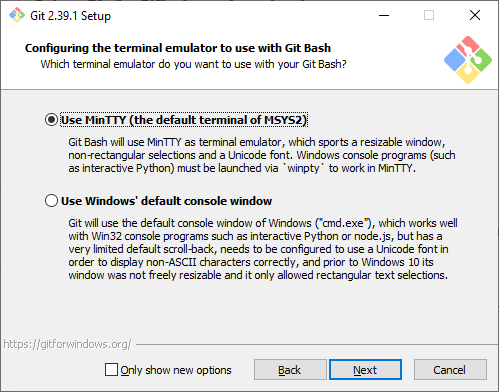

# Installation

Please run through all the steps below before the workshop tomorrow, as installation has a habit of taking up all the available time.  If you get stuck, come early (I will be there from 13:30) and we'll try and get you sorted.

## Install git

Instructions here vary by platform.

### Windows

In addition to "git" itself, you need a whole bunch of tools that simulate a minimal unix environment.  This is a bit weird, and I apologise.  Git was originally a unix tool, but it can be made to some degree to act like a windows command line tool.  For the workshop you'll be using the simulated unix environment though.

1. Go to https://git-for-windows.github.io and download the installer ([direct link](https://github.com/git-for-windows/git/releases/download/v2.7.0.windows.1/Git-2.7.0-32-bit.exe))
2. Run the installer, accepting all the defaults.
   * Either of the options "Use Git from Git Bash only" or "Use Git from the Windows Command Prompt" should be safe, while the "Use Git and optional Unix tools from the Windows Command Prompt" is not a good option as hinted by the big red warning underneath).

.
   * Please leave the "Checkout Windows-style, commit Unix-style line endings" option selected as this is _probably_ the path of least pain.

.
   * Please leave the "Use MinTTY (the default terminal of MSys2)" selected. (despite this dialogue being almost entirely undecipherable).  The upshot is it will be easier to copy and paste with that option selected.

.
3. Test that it works by running Start -> Git -> Git Bash which should open a window that looks a lot like cmd.exe; in this window type `git --version` and you should see something like `git version 2.7.0.windows.1` in response.

### Mac OS X

Apple installs a version of git with XCode, and in recent versions it is not too ancient.  To see if you're OK, open a terminal (Applications -> Utilities -> Terminal) and run `git --version`.  If you get a version like `git version 2.3.8 (Apple Git-58)` you should be fine (probably any version above 2.0.0 will be fine for our use).  If you get something like `git: command not found` you'll need to install git.

1. To install git, go to https://git-scm.com/download/mac and download the file
2. Open the resulting dmg and run the installer (you may have to hold down "control" when double clicking it to get around Apple's dislike of 3rd party software).
3. Click though the installation as there are no interesting options.  `git` will be installed at `/usr/local/bin/git` which is on your `PATH` by default.

### Linux

If you do not already have git install it with

* Ubuntu/Debian/Mint: `sudo apt-get install git`
* Fedora/RedHat: `sudo yum install git`

## Basic git configuration

It will save us a little time if you can run the following in git (Windows use "git bash", Mac and Linux use a terminal window)

```
git config --global user.name "Your name"
git config --global user.email "you@imperial.ac.uk"
```

If you then run

```
git config --global --list
```

you should see your name and email printed to screen.

## Install R and Rstudio

[Rstudio](https://rstudio.com) has some really nice integration with git, and hopefully we'll get time to cover it.  Please ensure you have a recent version of

* [R](https://cran.r-project.org/) (**but** if you're in the middle of a complicated analysis with a looming deadline please don't upgrade; it doesn't need to be crazy recent as we won't actually be doing and R work.
* [Rstudio](https://www.rstudio.com/products/rstudio/download/) -- this can be upgraded independently of R and a recent version maximises the chances that everything will work smoothly.

## Register for a GitHub account

GitHub is not git (it's built on top of git) and is not required for using git.  But it's pretty excellent and we'll be using it.

1. Go to https://github.com and register using your Imperial email address (you'll need that address added so you can get the education account).
2. (optional) If you don't like using your Imperial email address, after registering go to https://github.com/settings/emails and add your preferred email address. You can set that as primary later if you want.
3. Go to https://github.com/edu and click "Request a discount".  Add yourself as a Student or Researcher.  If you're a student ask for an "individual account".  If you're a PI you might be more interested in the "Organisation account".  Because you've signed up with your Imperial address this should be approved immediately via email.
